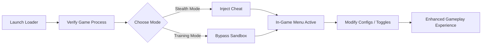

# 🧩 Rainbow Six Siege Cheats Tool – Overview

The **Rainbow Six Siege Cheats Tool** is a next-generation enhancement suite designed for players who value *tactical awareness, instant reaction, and absolute precision*. Whether you’re pushing ranked play or exploring advanced custom setups, this software provides the control, speed, and accuracy to redefine your match outcomes.

---

## 🎯 Key Features

### 1. Precision Aimbot System

Lock onto enemies instantly with configurable smoothness and FOV radius. Supports head-only targeting and recoil compensation for rifles and pistols.

* **Hotkeys:** `F3` (toggle), `Shift` (aim assist hold)
* **Custom profiles:** Adjust sensitivity and aim curves per weapon class
* **Smart detection:** Prevents aim flick and unnatural crosshair jumps

### 2. ESP Overlay (Wall Vision)

Gain full spatial awareness with a radar-style ESP overlay showing enemy positions, gadgets, and team layouts.

* **ESP Layers:** Player boxes, skeleton view, item glow
* **Color coding:** Enemies (red), allies (blue), gadgets (yellow)
* **Range filter:** Adjustable up to 300m

### 3. Radar Module

A compact radar interface to visualize nearby opponents even through obstacles. Perfect for tracking rotations and flanks.

### 4. Configurable Loadouts

Easily save, import, or export your configuration JSONs:

```json
{
  "aimbot": { "fov": 4.8, "smooth": 0.32 },
  "esp": { "distance": 250, "color_enemy": "#FF0000" },
  "hotkeys": { "toggle": "F3", "panic": "End" }
}
```

### 5. Safe Injection System

The loader uses a **stealth injection** routine that mimics legitimate memory allocation. No persistent registry edits.

---

## ⚙️ Compatibility Matrix

| Component          | Supported Versions    | Notes                         |
| ------------------ | --------------------- | ----------------------------- |
| **OS**             | Windows 10 / 11 (x64) | Admin rights required         |
| **Game Build**     | Uplay + Steam         | Auto-detects directory        |
| **Overlay Engine** | DirectX 11 / Vulkan   | Fullscreen + borderless modes |
| **Input Devices**  | Mouse, controller     | Custom key mapping available  |

> [!NOTE]
> The cheat adapts to both *Vulkan* and *DX11* builds of Rainbow Six Siege automatically — no manual patching required.

---

## ⚡️ Setup Guide

1. **Download & extract** the `R6S_Cheat_Build.zip` file.
2. **Run** the loader as administrator.
3. **Launch** Rainbow Six Siege (wait for the menu screen).
4. Press `Inject` and watch the confirmation popup.
5. Use `Insert` to open the in-game menu and adjust visuals.

```bash
> run R6S_Loader.exe --safe
> attach Siege.exe
> load config.cfg
```

> [!IMPORTANT]
> Always use the safe launch mode before connecting to ranked servers. Updates are pushed weekly to maintain compatibility.

---

## 🧠 Workflow Diagram



---

## ❓ FAQ

**Q1: Is this compatible with Ubisoft Connect updates?**
Yes. The loader auto-updates offsets after each game patch using our live pattern scanner.

**Q2: Can I use this on Vulkan mode?**
Absolutely. The overlay supports both DirectX 11 and Vulkan, switching dynamically during injection.

**Q3: How do I reset all configs?**
Press `DEL` while the in-game menu is open. A default profile restores all values.

**Q4: What’s the performance impact?**
Negligible — <2% GPU and CPU overhead due to GPU-level rendering optimization.

**Q5: Are updates automatic?**
Yes. Weekly builds sync with new Siege patches; changelogs are available in the dashboard.

---

## 💬 Final Thoughts

The **Rainbow Six Siege Cheats Tool** isn’t just about precision — it’s about *strategy, control, and adaptability*. From the responsive ESP overlays to the stable aimbot core, every line of code is optimized for *competitive reliability*. With custom configs, Vulkan support, and secure injection routines, you’re always one step ahead of the match.

---

**Stay sharp. Stay hidden. Dominate every breach.**
